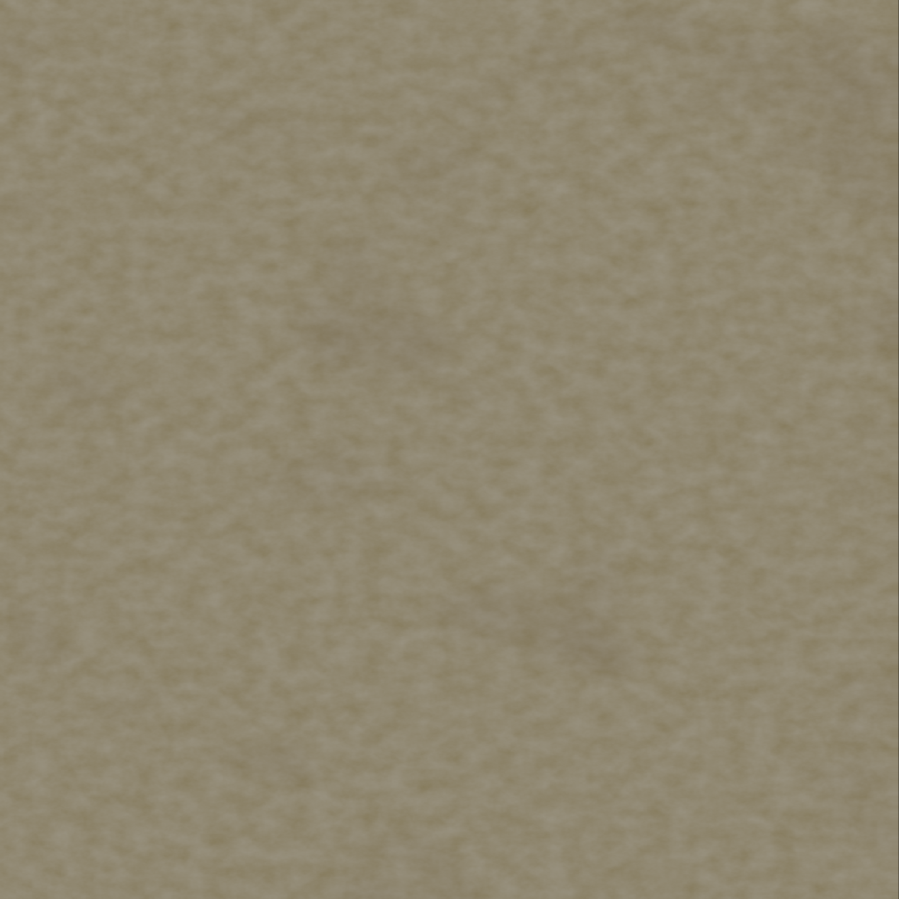

# Blender: podloga Level 0 od zera

Ten tutorial jest dla osoby, ktora pierwszy raz otwiera Blendera. Celem jest zrobienie podlogi do pierwszego levelu: brudna zolto-bezowa wykladzina Backrooms.

Ja juz przygotowalem tekstury PBR i podlaczylem je w Godot:



Pliki:

- `Assets/Graphics/Level0/level0_real_carpet_albedo.png`
- `Assets/Graphics/Level0/level0_real_carpet_normal.png`
- `Assets/Graphics/Level0/level0_real_carpet_roughness.png`
- `Materials/M_Floor.tres`
- `Models/Level0/level0_floor_reference.obj`

## Cel wymiarow

Pierwszy level ma podloge:

- szerokosc: `18 m`
- dlugosc: `26 m`
- wysokosc podlogi: `0 m`

W Blenderze zrobimy plane o wymiarach `18 x 26`. W Godot to odpowiada obecnej podlodze w `Level01_LiminalLobby.tscn`.

## Krok 1: otworz Blender

1. Otworz Blender.
2. Zobaczysz startowa kostke.
3. Kliknij kostke lewym przyciskiem myszy, zeby byla zaznaczona.
4. Nacisnij `X`.
5. Kliknij `Delete`.

Masz teraz pusta scene.

## Krok 2: ustaw jednostki

1. Po prawej stronie znajdz panel `Properties`.
2. Kliknij ikonke `Scene Properties`.
   - Wyglada jak mala kulka/stozek z osiami.
3. Znajdz sekcje `Units`.
4. Ustaw:
   - `Unit System` = `Metric`
   - `Length` = `Meters`

Od teraz 1 jednostka w Blenderze traktujemy jak 1 metr w Godot.

## Krok 3: dodaj plane

1. Nacisnij `Shift + A`.
2. Wybierz `Mesh`.
3. Wybierz `Plane`.

Na srodku sceny pojawi sie kwadrat.

## Krok 4: wpisz rozmiar podlogi

1. Nacisnij `N`, zeby otworzyc prawy boczny panel w widoku 3D.
2. Kliknij zakladke `Item`.
3. W sekcji `Transform` ustaw:
   - `Location X` = `0`
   - `Location Y` = `0`
   - `Location Z` = `0`
   - `Rotation X/Y/Z` = `0`
   - `Dimensions X` = `18`
   - `Dimensions Y` = `26`
   - `Dimensions Z` = `0`

4. Nacisnij `Ctrl + A`.
5. Kliknij `Scale`.

To jest wazne: `Ctrl + A > Scale` zapisuje skale w modelu. Bez tego Godot czasem importuje dziwne rozmiary.

## Krok 5: nazwij obiekt

1. W prawym gornym rogu jest lista obiektow, czyli `Outliner`.
2. Kliknij dwa razy nazwe `Plane`.
3. Zmien nazwe na:

```text
level0_floor_real_carpet
```

Dobre nazwy pomagaja pozniej, gdy scena robi sie duza.

## Krok 6: dodaj material

1. Zaznacz podloge.
2. Po prawej stronie kliknij ikonke `Material Properties`.
   - Wyglada jak czerwona kulka.
3. Kliknij `New`.
4. Nazwij material:

```text
M_Level0_RealCarpet
```

5. W polu `Base Color` ustaw kolor zblizony do zolto-bezowego.
   - To tylko podglad. Prawdziwa tekstura bedzie w Godot albo w shader nodes.

## Krok 7: dodaj teksture w Blenderze

To jest opcjonalne, ale warto zobaczyc efekt juz w Blenderze.

1. Na gorze Blendera kliknij workspace `Shading`.
2. Na dole zobaczysz `Shader Editor`.
3. Upewnij sie, ze podloga jest zaznaczona.
4. Nacisnij `Shift + A`.
5. Wybierz `Texture > Image Texture`.
6. W nowym node kliknij `Open`.
7. Wybierz plik:

```text
Assets/Graphics/Level0/level0_real_carpet_albedo.png
```

8. Polacz:
   - zolte wyjscie `Color` z Image Texture
   - do `Base Color` w `Principled BSDF`

9. W prawym gornym rogu widoku 3D kliknij tryb podgladu materialow.
   - To ikonka kulki z szachownica/materialem.

Teraz powinienes widziec wykladzine na plane.

## Krok 8: ustaw UV, czyli rozlozenie tekstury

Jezeli tekstura jest za duza albo za mala:

1. Kliknij workspace `UV Editing`.
2. Zaznacz podloge.
3. Nacisnij `Tab`, zeby wejsc w `Edit Mode`.
4. Nacisnij `A`, zeby zaznaczyc cala podloge.
5. Nacisnij `U`.
6. Wybierz `Unwrap`.

Po lewej zobaczysz UV.

Najprosciej:

1. W lewym panelu UV nacisnij `A`.
2. Nacisnij `S`, zeby skalowac UV.
3. Wpisz `5`.
4. Nacisnij `Enter`.

Im wieksze UV, tym czesciej tekstura sie powtarza. Dla tej podlogi w Godot ustawilem podobny efekt przez `uv1_scale`.

## Krok 9: dodaj delikatne podzialy kafli

Tekstura juz ma linie kafli, ale mozesz tez dodac lekka geometrie.

1. W `Edit Mode` nacisnij `A`.
2. Kliknij prawym przyciskiem myszy na podloge.
3. Wybierz `Subdivide`.
4. W lewym dolnym rogu pojawi sie male okno operacji.
5. Ustaw `Number of Cuts` na `7`.

To podzieli plane na siatke. Na tym etapie nie musisz nic bardziej komplikowac.

## Krok 10: zapisz plik Blendera

1. Kliknij `File`.
2. Kliknij `Save As`.
3. Zapisz plik jako:

```text
Models/Level0/blender/level0_floor_real_carpet.blend
```

Jesli folderu `blender` nie ma, utworz go.

## Krok 11: eksport do Godot

1. Zaznacz podloge.
2. Kliknij `File`.
3. Kliknij `Export`.
4. Wybierz `glTF 2.0 (.glb/.gltf)`.
5. Po prawej stronie w opcjach eksportu ustaw:
   - `Format` = `glTF Binary (.glb)`
   - wlacz `Selected Objects`
6. Zapisz jako:

```text
Models/Level0/level0_floor_from_blender.glb
```

Godot automatycznie zobaczy ten plik po powrocie do edytora.

## Krok 12: jak uzyc w Godot

Na razie ja podmienilem material istniejacej podlogi:

```text
Materials/M_Floor.tres
```

Ten material korzysta z:

- albedo,
- normal map,
- roughness map,
- tilingu UV.

Kiedy zrobisz wlasny model:

1. Otworz Godot.
2. Wejdz do `Scenes/Levels/Level01_LiminalLobby.tscn`.
3. Mozesz na razie zostawic stara podloge jako kolizje.
4. Dodaj swoj model jako widoczna podloge nad nia.
5. Ustaw model bardzo lekko nad CSG podloga, np. `Y = 0.08`, zeby nie migotal.

## Twoje zadanie: sciany

Ty robisz sciany w tej samej skali.

Proponowany modul sciany:

- szerokosc: `4 m`
- wysokosc: `3.2 m`
- grubosc: `0.35 m`

W Blenderze:

1. `Shift + A > Mesh > Cube`
2. `N > Item > Dimensions`
3. Ustaw:
   - `X = 4`
   - `Y = 0.35`
   - `Z = 3.2`
4. `Ctrl + A > Scale`
5. Nazwa:

```text
wall_level0_real_A
```

Eksport:

```text
Models/Level0/wall_level0_real_A.glb
```

## Najczestsze problemy

### Tekstura jest rozmazana

Zwieksz tiling/UV scale.

### Model w Godot jest za maly albo za duzy

W Blenderze zrob `Ctrl + A > Scale`, potem eksportuj jeszcze raz.

### Podloga miga w Godot

To znaczy, ze dwie powierzchnie sa w tym samym miejscu. Podnies model o `0.03-0.08 m`.

### Tekstura jest za czysta

Dodaj wiecej plam w teksturze albo dodaj osobne brudne decals na podlodze.
