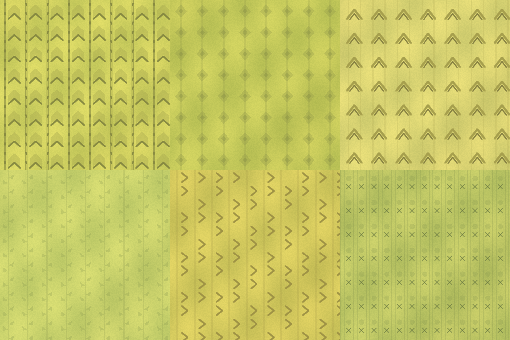

# Level 0 - warianty tapety na sciany

Na podstawie referencji powstalo 6 wariantow zoltej tapety Backrooms.

Podglad:



Pliki PNG:

- `Assets/Graphics/Level0/WallpaperVariants/level0_wallpaper_variant_01.png`
- `Assets/Graphics/Level0/WallpaperVariants/level0_wallpaper_variant_02.png`
- `Assets/Graphics/Level0/WallpaperVariants/level0_wallpaper_variant_03.png`
- `Assets/Graphics/Level0/WallpaperVariants/level0_wallpaper_variant_04.png`
- `Assets/Graphics/Level0/WallpaperVariants/level0_wallpaper_variant_05.png`
- `Assets/Graphics/Level0/WallpaperVariants/level0_wallpaper_variant_06.png`

Materialy:

- `Materials/WallVariants/M_Level0_Wallpaper_01.tres`
- `Materials/WallVariants/M_Level0_Wallpaper_02.tres`
- `Materials/WallVariants/M_Level0_Wallpaper_03.tres`
- `Materials/WallVariants/M_Level0_Wallpaper_04.tres`
- `Materials/WallVariants/M_Level0_Wallpaper_05.tres`
- `Materials/WallVariants/M_Level0_Wallpaper_06.tres`

Skrypt losowania:

- `Scripts/World/RandomWallPatternApplier.cs`

## Jak to dziala

W `Scenes/Levels/Level01_LiminalLobby.tscn` jest node:

```text
RandomWallPatterns
```

Ten node:

1. Laduje 6 materialow tapety.
2. Szuka geometrii w `Blockout`.
3. Sprawdza nazwy node'ow.
4. Jesli node ma w nazwie `Wall`, `Pillar`, `Block` albo `Nook`, losuje mu jeden material.

## Jak dodac kolejny wzor

1. Dodaj PNG do:

```text
Assets/Graphics/Level0/WallpaperVariants/
```

2. Dodaj material `.tres` do:

```text
Materials/WallVariants/
```

3. Dopisz sciezke w:

```text
Scripts/World/RandomWallPatternApplier.cs
```

Tablica:

```csharp
private readonly string[] _defaultMaterialPaths =
```

## Jak miec stale losowanie

W node `RandomWallPatterns` ustaw:

```text
UseRandomSeed = false
FixedSeed = 1717
```

Wtedy poziom zawsze bedzie mial te same wzory na tych samych scianach.
