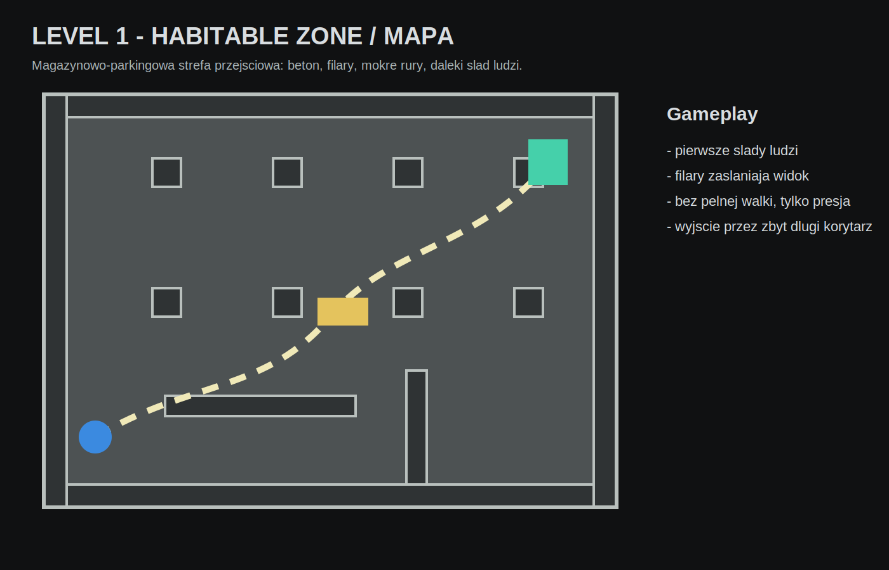
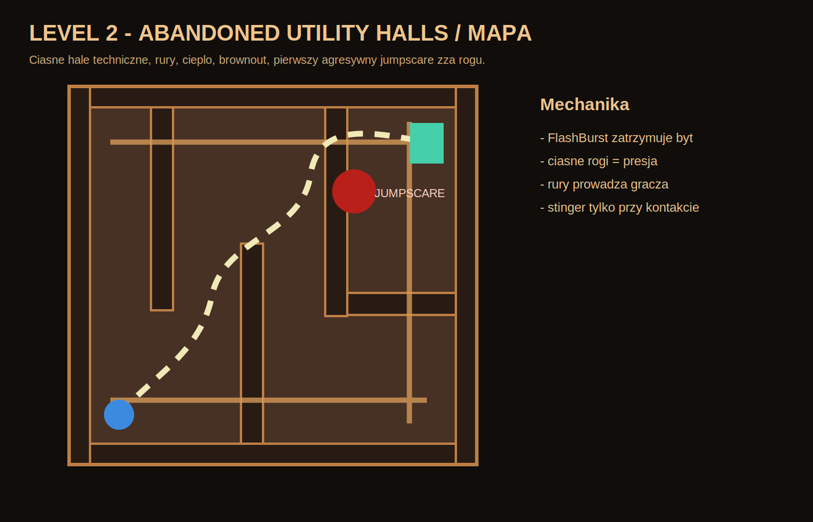
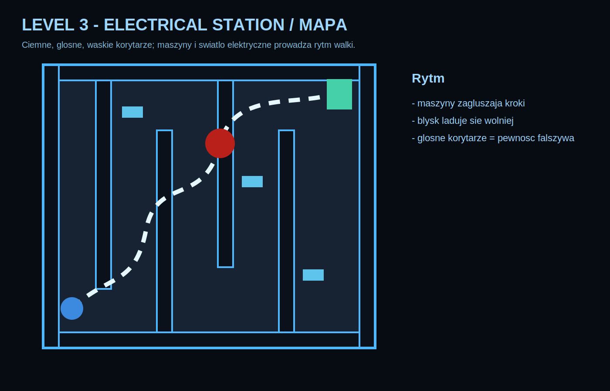
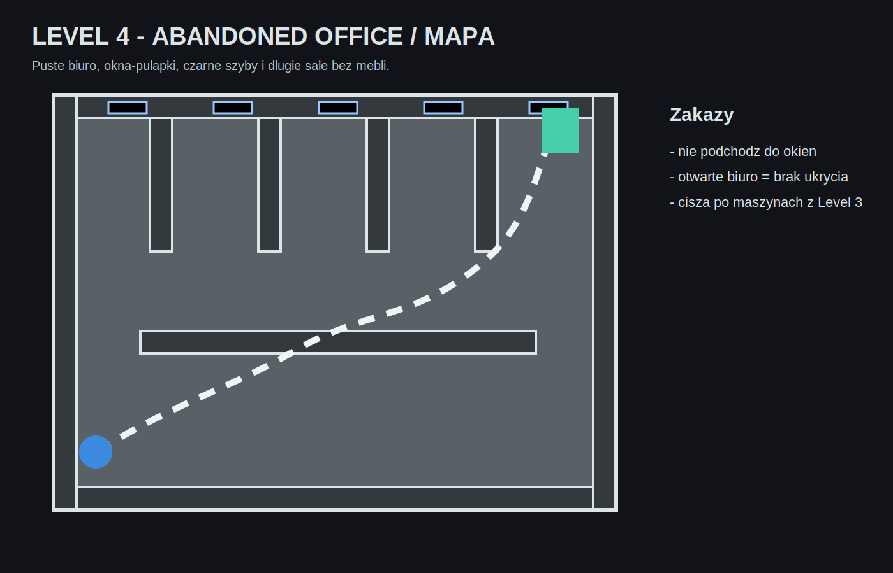

# Jak tworzyc poziomy w tym projekcie

Ten projekt na razie uzywa prostych bryl. To dobrze. Blockout musi byc grywalny zanim modelowanie zrobi go ladnym.

## Najprostsza droga

1. Stworz scene `.tscn` w `Scenes/Levels/`.
2. Dodaj Node3D jako root.
3. Podepnij skrypt `Scripts/World/BackroomsLevelBuilder.cs`.
4. Ustaw:

```text
BackroomsLevel = 1
NextScenePath = "res://Scenes/Levels/NastepnyLevel.tscn"
```

5. Uruchom gre i sprawdz, czy gracz pojawia sie przy `PlayerSpawn`.

## Co robi BackroomsLevelBuilder

Builder tworzy:

- `PlayerSpawn`,
- podloge, sufit i sciany,
- slupy albo korytarze,
- swiatla,
- mapy i plakaty fabularne,
- trigger audio,
- checkpoint,
- trigger wyjscia,
- enemy albo jumpscare, jesli profil tego potrzebuje.

Najwazniejsze funkcje:

```csharp
AddRoomShell(...)
AddPosterPair(...)
AddCheckpoint(...)
AddFearZone(...)
AddHiddenJumpscareEnemy(...)
AddExit(...)
```

## Jak dodac nowy profil poziomu

1. Otworz `Scripts/World/BackroomsLevelBuilder.cs`.
2. W `switch (BackroomsLevel)` dodaj nowy przypadek, np. `case 5`.
3. Stworz metode, np. `BuildHotelLoop()`.
4. W tej metodzie dodaj:
   - `AddPlayerSpawn`,
   - `AddAudioProfile`,
   - `AddRoomShell`,
   - minimum jedno swiatlo,
   - minimum jeden plakat fabularny,
   - `AddExit`.

Przyklad szkieletu:

```csharp
private void BuildHotelLoop()
{
    AddPlayerSpawn(new Vector3(0f, 0.1f, 12f));
    AddAudioProfile("res://Assets/Audio/ambient_fluorescent_hum.wav", "res://Assets/Audio/ambient_low_rumble.wav", -20f, -34f, -18f, 0.3f);
    AddRoomShell("HotelShell", new Vector2(20f, 32f), 3.0f);
    AddLight("Lamp_01", new Vector3(0f, 2.7f, 8f), 1.0f, 7f, new Color(0.9f, 0.8f, 0.6f), true);
    AddPosterPair(new Vector3(-4f, 1.6f, 15.8f), new Vector3(4f, 1.6f, 15.8f), "Tekst historii.", 12f, 0.4f);
    AddExit(new Vector3(0f, 1.35f, -15.8f), "Nastepny level jeszcze nie istnieje.");
}
```

## Grafiki poziomow

Mapy SVG:






Tekstury:

- `Assets/Graphics/Level1/level1_concrete_tile.svg`
- `Assets/Graphics/Level2/level2_pipe_wall_tile.svg`
- `Assets/Graphics/Level3/level3_electric_panel_tile.svg`
- `Assets/Graphics/Level4/level4_office_wall_tile.svg`

## Zasady level designu horroru

- Najpierw daj przestrzen, potem ja zabierz.
- Nie dawaj enemy w pierwszych minutach, jesli sam pokoj potrafi straszyc.
- Zakret jest mocniejszy niz otwarta arena.
- Jeden martwy koniec powinien wygladac jak nagroda, ale dawac tylko niepokoj.
- Wyjscie powinno byc widoczne wczesniej, ale nie od razu dostepne.
