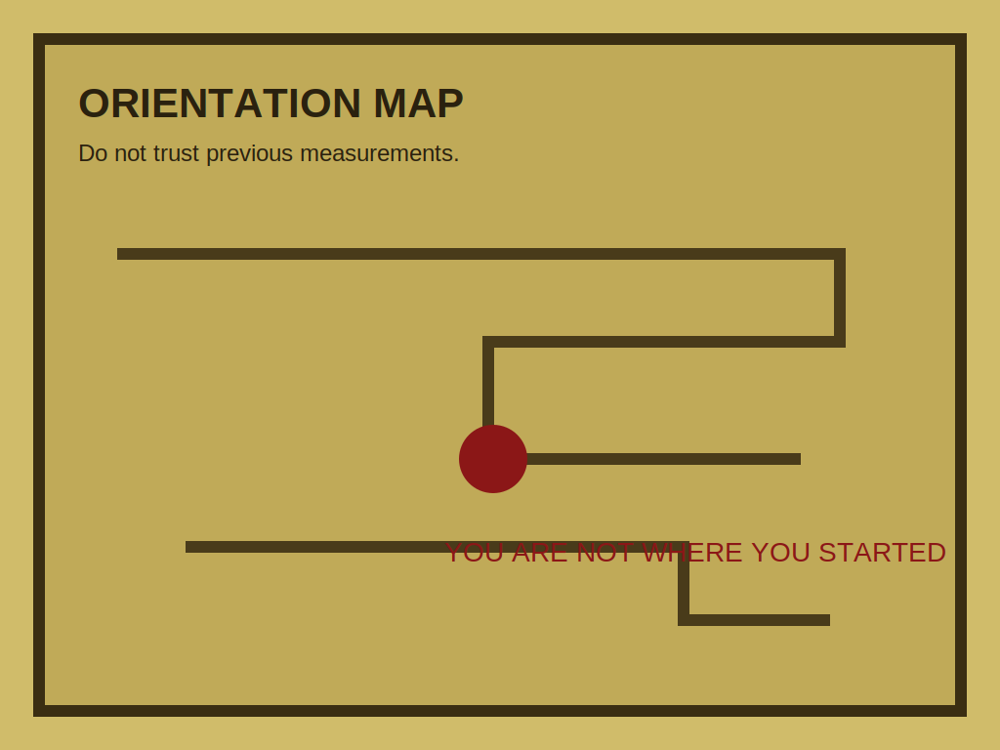
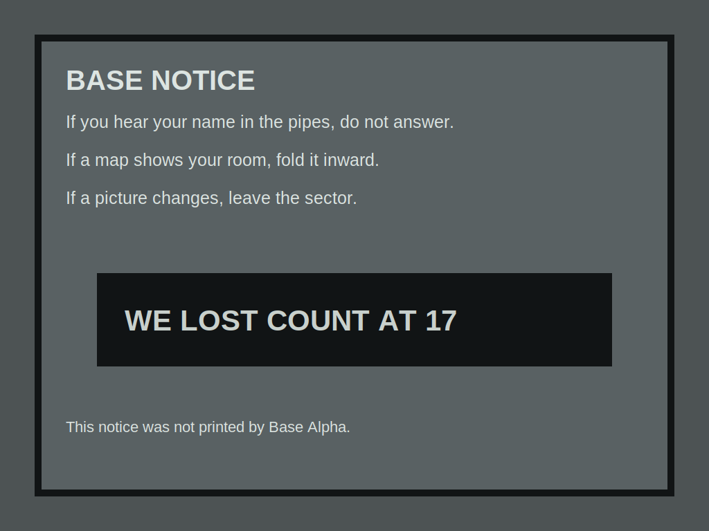
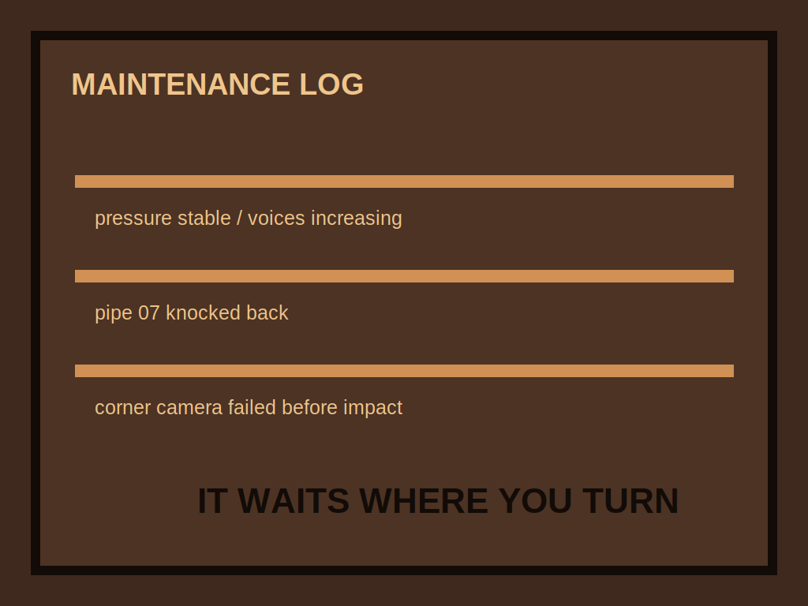
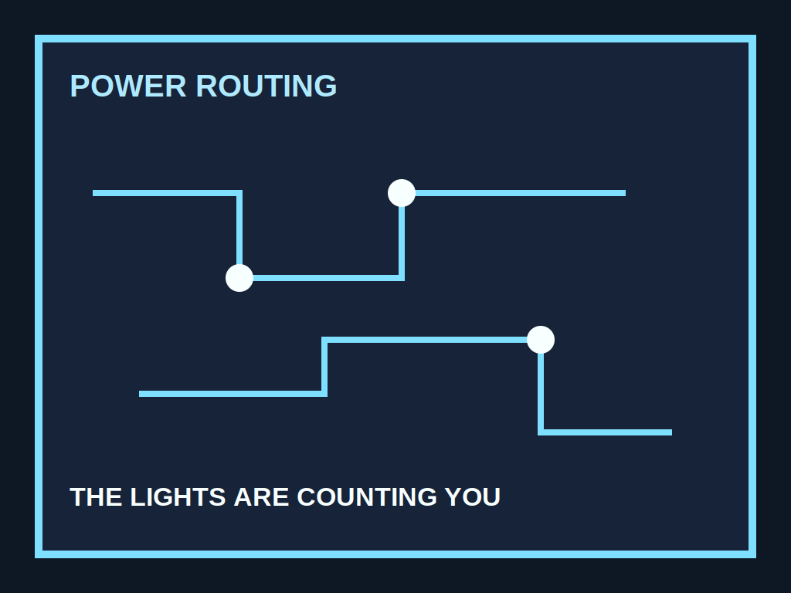
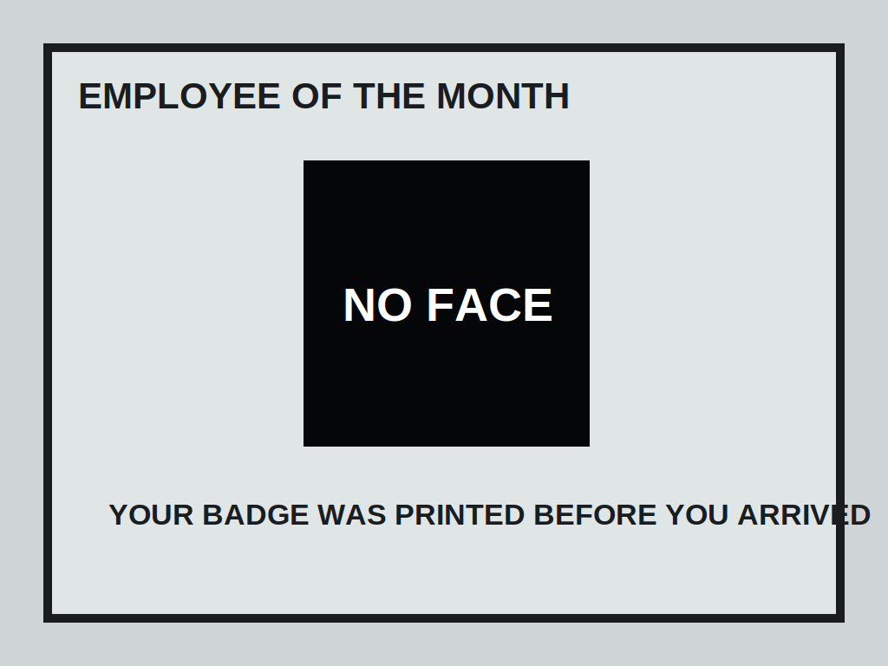

# Fabula przez obrazy na scianach

Glowny pomysl fabularny: Backrooms nie tylko wie, gdzie jest gracz. Ono powoli uczy sie jego zycia i zaczyna pokazywac mu obrazy, ktore nie mogly jeszcze powstac.

## Bohater

Gracz nie zna od razu przyczyny wejscia do Backrooms. Pierwsze poziomy sugeruja, ze "wypadl z rzeczywistosci". Pozniej obrazy zaczynaja zdradzac, ze ktos albo cos obserwowalo go jeszcze przed wejsciem.

## Motyw przewodni

Kazdy obraz wyglada jak dokumentacja. Nie jak sztuka. Bardziej jak:

- zdjecie z monitoringu,
- mapa ewakuacji,
- karta pracownika,
- raport techniczny,
- kadr z kamery, ktorej nie ma.

## Obrazy w projekcie

## Beat po poziomach

### Level 0 - Threshold

Obraz pokazuje wejscie do pokoju, w ktorym gracz stoi. Brakuje tylko jego sylwetki. To pierwszy sygnal, ze przestrzen nie jest przypadkowa.

Trigger:

- `StoryTrigger_Threshold` w `Level01_LiminalLobby.tscn`

### Level 1 - Habitable Zone

Obraz pokazuje ludzi w niby-bezpiecznej bazie. Na drugim planie wisi kurtka gracza. To sugeruje, ze ktos juz tu byl albo ze poziom umie falszowac wspomnienia.

Trigger:

- Tworzony przez `BackroomsLevelBuilder.BuildHabitableZone()`

### Level 2 - Utility Halls

Obraz jest planem rur. Jedna linia ma imie gracza i prowadzi do zakretu z jumpscarem. To pierwszy raz, gdy obraz nie tylko opisuje, ale prowadzi do zagrozenia.

Trigger:

- Tworzony przez `BackroomsLevelBuilder.BuildUtilityHalls()`

### Level 3 - Electrical Station

Obraz jest przepalony blyskiem. W bialej plamie widac sylwetke podnoszaca reke jak gracz podczas FlashBurst. To laczy mechanike walki z fabula.

Trigger:

- Tworzony przez `BackroomsLevelBuilder.BuildElectricalStation()`

### Level 4 - Abandoned Office

Obraz wyglada jak instrukcja ewakuacji z mieszkania gracza. Level zaczyna sugerowac, ze wyjscie niekoniecznie prowadzi do domu, tylko do wersji domu zrobionej przez Backrooms.

Trigger:

- Tworzony przez `BackroomsLevelBuilder.BuildAbandonedOffice()`

## Jak pisac kolejne teksty

Zasada: tekst nie wyjasnia za duzo. Ma zostawic pytanie.

Dobre:

- "Na zdjeciu drzwi sa otwarte. W tym pokoju nie ma drzwi."
- "Plan ewakuacji prowadzi do twojej kuchni."
- "Ktos zakleil twarz na wszystkich pracownikach oprocz twojej."

Slabsze:

- "To jest potwor i zaraz cie zaatakuje."
- "Musisz isc do kolejnego poziomu."
- "Backrooms jest zle."

## Kierunek fabuly

W pozniejszych poziomach obrazy moga stac sie mechanika:

- obraz zmienia uklad pokoju po spojrzeniu,
- obraz pokazuje enemy zanim pojawi sie w realu,
- obraz ma fragment kodu/drzwi/znaku,
- obraz klamie i prowadzi gracza w pulapke,
- obraz jest jedynym miejscem, gdzie widac prawdziwe wyjscie.
